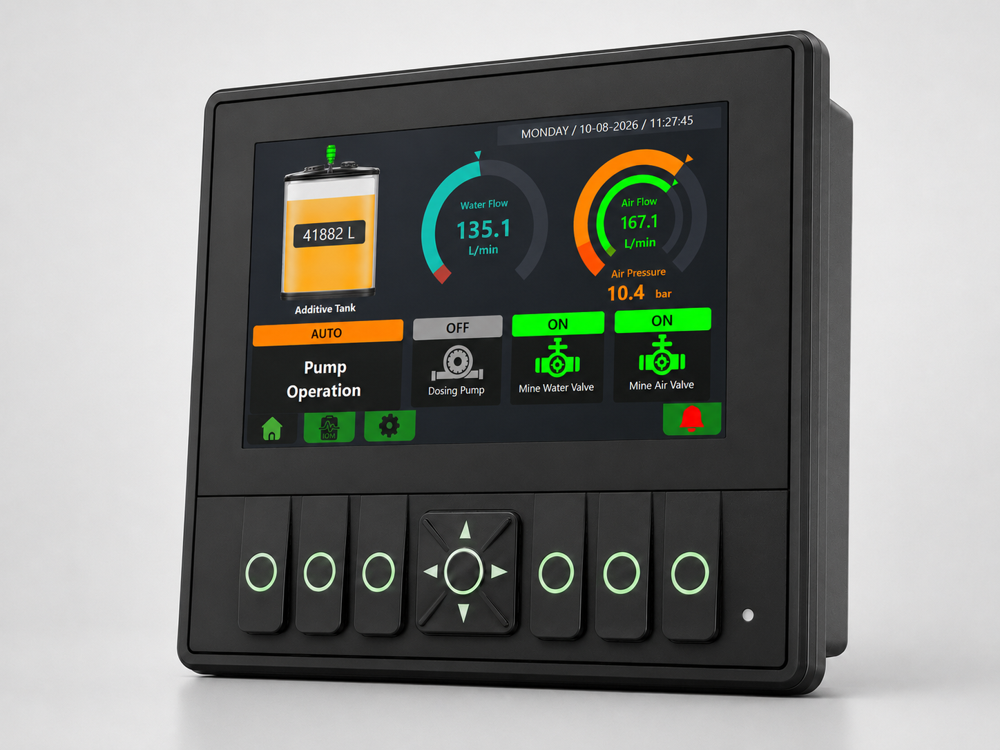
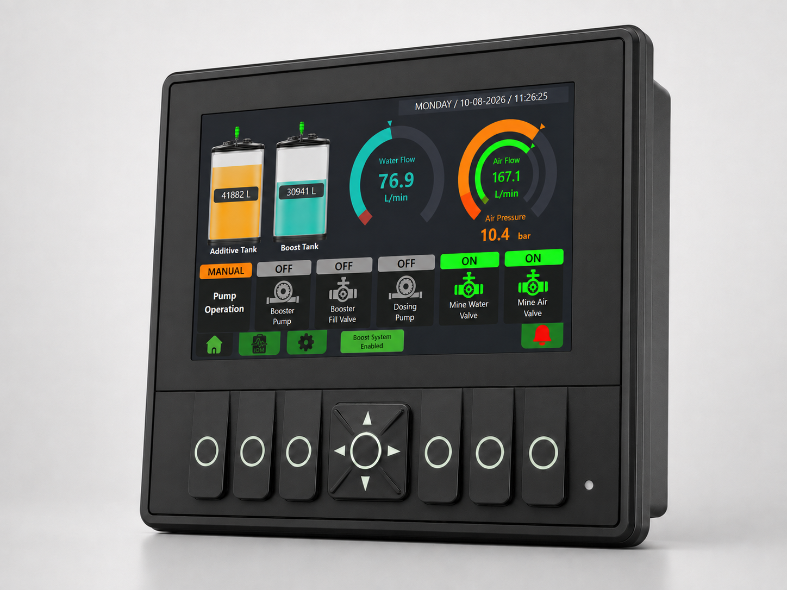
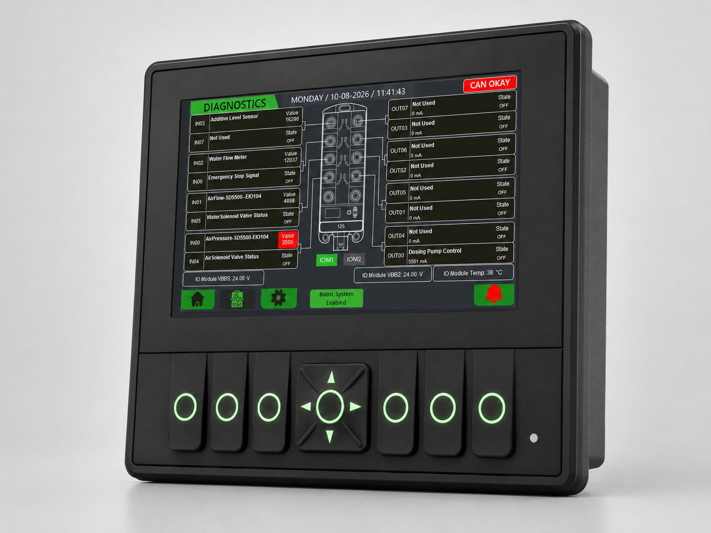
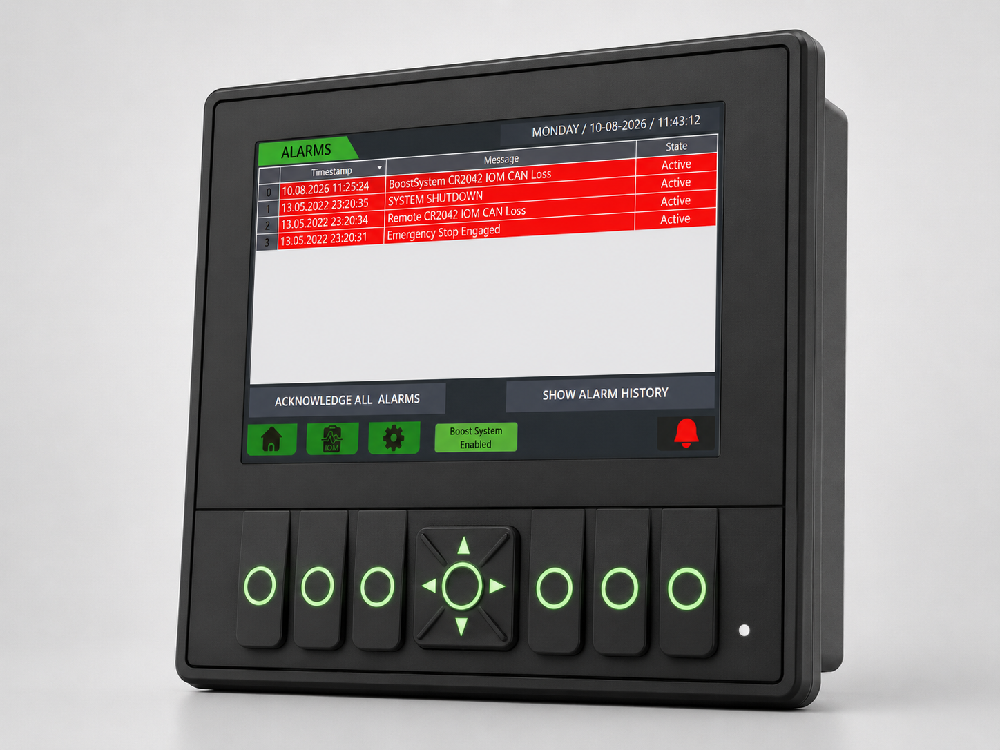
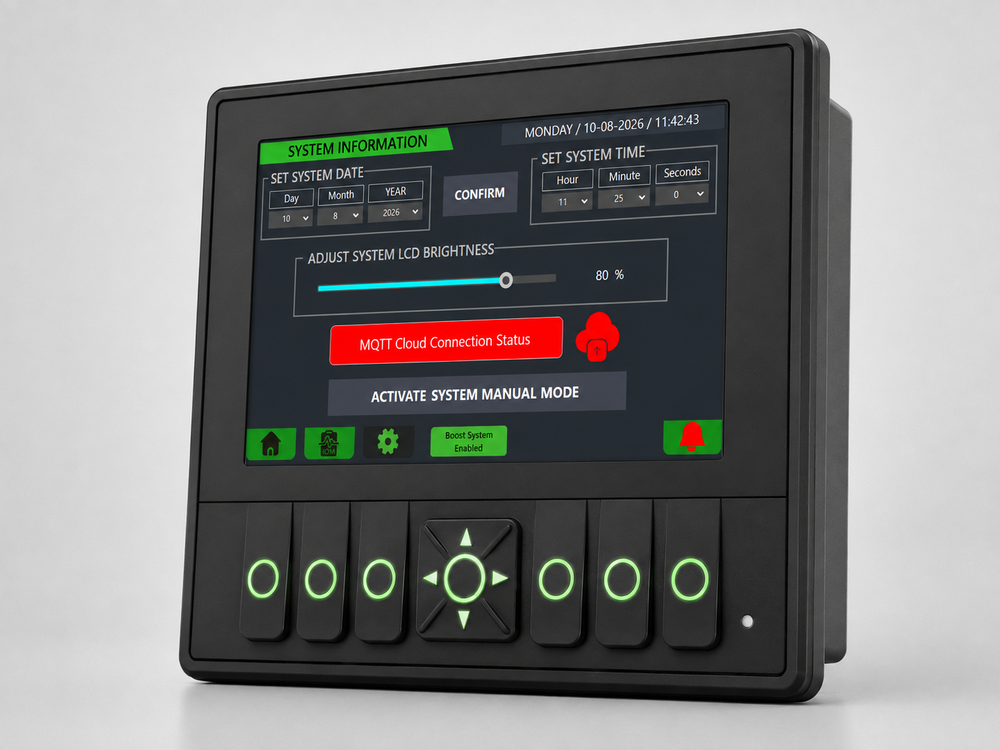
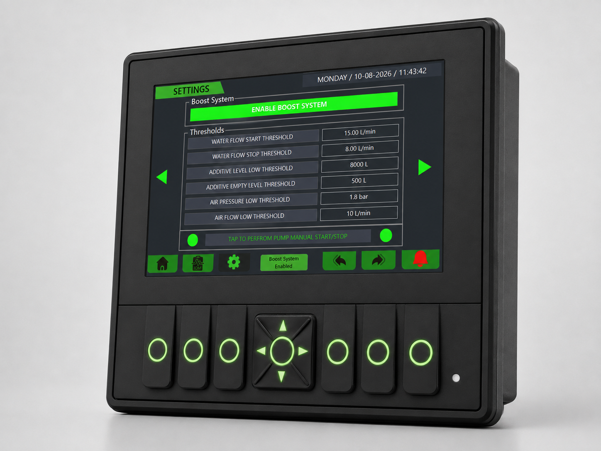
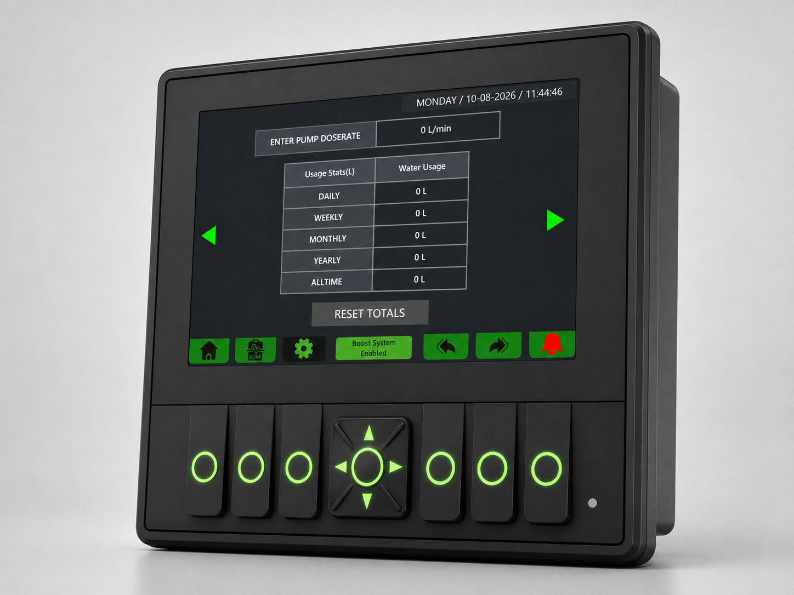
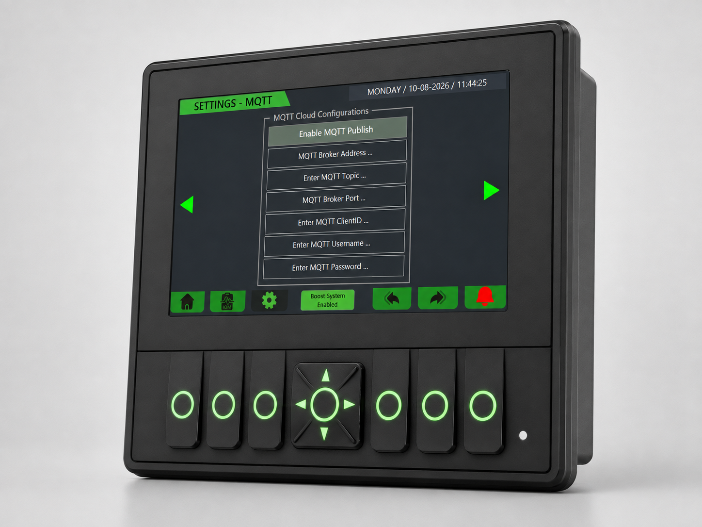

+++
title = "Mine Chemical Dosing System"
description = "Industrial chemical dosing and water management system developed using CODESYS, PLC control, HMI design, remote I/O and MQTT communication."
date = 2026-08-10

[taxonomies]
tags = ["PLC Programming", "HMI Design", "Remote I/O", "MQTT", "Industrial Automation"]
+++

An industrial chemical dosing system developed to automatically dose liquid additive into a mine water line based on real-time water flow.

The system was built around an IFM CR1140 PLC/HMI with distributed I/O, industrial sensors, pump control and MQTT-based remote monitoring. An optional booster system was also integrated for applications where the available mine water pressure was insufficient.

---

## Project Overview

The system monitors mine water flow, valve status, additive level and other process conditions before enabling the dosing pump.

The CR1140 performs the control logic while distributed I/O handles field signal acquisition. The integrated HMI provides operator control, diagnostics, alarms and configurable system parameters.

The main system architecture is:

**Field Sensors → Remote I/O → IFM CR1140 PLC/HMI**

Remote monitoring is provided through:

**CR1140 → Teltonika Industrial Router → MQTT → Remote Server**

### Main Hardware

| Component | Function |
| --- | --- |
| IFM CR1140 | Main PLC, HMI and communications controller |
| IFM CR2042 – IOM1 | Main distributed I/O |
| IFM CR2042 – IOM2 | Booster system I/O |
| IFM SD5500 | Air pressure and air flow measurement |
| IFM EIO104 | IO-Link to analogue signal conversion |
| Grundfos DDA 7.5–16 | Chemical dosing pump |
| Teltonika Industrial Router | Remote network and MQTT connectivity |

---

## My Contribution

I developed the controller application on CODESYS using Structured Text.

My work covered:

- System functionality control logic and interlocks
- HMI design and user navigation
- Distributed I/O integration
- Pump and booster control
- Alarm and system I/O diagnostic handling
- Sensor signal scaling and processing
- MQTT communication and remote monitoring
- Configuration and system diagnostic functions

---

## System & Control

The dosing sequence was implemented as a flow-driven control strategy.

During automatic operation, the PLC checks the operating mode, emergency-stop circuit, water valve status, measured water flow and critical system conditions before enabling the dosing pump.

The general sequence is:

1. AUTO mode is always ON by default.
2. Critical interlocks are confirmed healthy.
3. The mine-controlled water and air valve signals an open status.
4. Water flow rises above the configured start threshold.
5. The dosing pump is enabled.
6. Dosing continues while flow remains above the stop threshold.
7. Loss of flow, valve closure or a critical fault stops the pump.

Separate flow start and stop thresholds were implemented to provide hysteresis and prevent unnecessary pump cycling.

A manual operating mode was also implemented for maintenance and testing while retaining the required safety interlocks.

### Booster System

The optional booster system was integrated using a second remote I/O module.

The PLC monitors the booster tank level and controls the fill solenoid using configurable low and high level thresholds. The booster pump operates with the mine-controlled water request.

A fill monitoring function is also implemented to detect when the fill solenoid remains active without a corresponding increase in tank level. This generates a **Booster Tank Fill Failure** alarm.

---

## HMI Design

The HMI was developed on the integrated IFM CR1140 display and structured around the operator's workflow.
Normal operation, diagnostics, alarms and configuration were separated into dedicated screens to keep the main operating interface focused on essential mine system information. Since display is non-touch, a dedicated button-navigation system is implemented, allowing operators to access the main pages through dedicated buttons, while specific button combinations or hold actions provide access to protected configuration pages.

### Standard Home Page

The standard home page provides the primary operating overview for the dosing system.

The layout groups the main process values, equipment states and operator controls into a single screen. Water flow, valve status, dosing pump status, additive level and operating mode are presented together so the operator can quickly determine the current system condition.

### Booster Home Page

A dedicated booster home page was implemented for installations where the optional booster system is enabled.

The page provides visibility of the booster tank level, booster pump and fill system without adding unnecessary information to the standard dosing screen. This allows the same HMI application to support both configurations.

### Diagnostics Page

The diagnostics page was designed for commissioning and troubleshooting.

Relevant process values, field signals, I/O states and system conditions are grouped into a dedicated diagnostic interface. This provides technicians with direct visibility of system operation without requiring access to the PLC application.

### Alarms Page

The alarm interface was implemented as a dedicated screen for monitoring active system conditions and operator acknowledgement.

The alarm information is kept separate from the main operating screen so that fault conditions can be identified without obscuring the process overview. Critical alarm conditions are linked to the corresponding PLC interlocks and shutdown logic.

### System Information Page

The system information page provides controller, system and communication information used during commissioning and maintenance.

System-level information is separated from the main process values to keep the normal operator interface focused while still providing access to communication and controller status when required.

### Configuration Pages

Configuration functions were separated from the normal operator interface and protected through specific button hold combination actions.

The threshold settings page provides access to configurable process parameters used by the control logic. Separating these parameters from the main operating screen keeps the operator interface simple while allowing authorised users to adjust system settings.

The totaliser settings page provides configuration for the accumulated process measurements used by the system.

The MQTT settings page groups communication parameters separately from the process controls. This keeps network configuration outside the normal operator workflow while providing the required access during commissioning and maintenance.

---

## Remote Monitoring

MQTT communication was implemented to provide remote visibility of the dosing system.

The CR1140 publishes process values, equipment states, alarms and system health information through the Teltonika industrial router to the remote MQTT server.

The remote monitoring system was kept independent from the local control sequence. A loss of network connectivity therefore does not interrupt local dosing operation.

Connection retrials and local data buffering is also implemented to handle temporary network interruptions. Buffered telemetry is transmitted once communication with the remote server is restored.